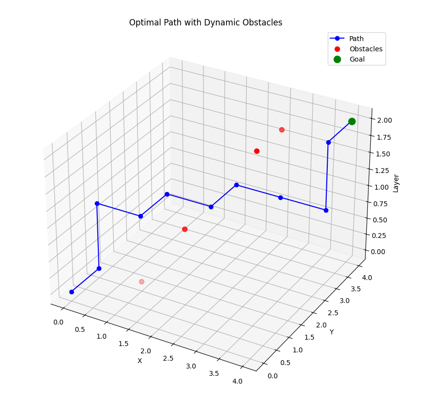

# Autonomous3DPathfinder

**Autonomous3DPathfinder** is a reinforcement learning-based agent designed to navigate a 3D Grid environment and find the optimal path from a start position to a goal while avoiding dynamic obstacles. The agent uses Q-learning to improve its decision-making over multiple episodes. It incorporates real-world challenges, such as moving obstacles, to mimic realistic pathfinding problems.

### Features

- **3D Grid Navigation:** The agent can navigate a 3D grid (layers, rows, columns) to find the shortest path to the goal.
- **Dynamic Obstacles:** Obstacles in the environment move randomly at set intervals, adding complexity to the pathfinding challenge.
- **Q-Learning:** The agent uses Q-learning to update its action-value function and improve its performance over time.
- **Epsilon-Greedy Policy:** The agent explores the environment randomly with a probability (epsilon) to ensure effective exploration and exploitation.
- **Optimal Path Finding:** After training, the agent can find the best path from start to goal based on its learned Q-table.
- **Multiple Layers and Dimensions:** The environment consists of multiple layers, rows, and columns, allowing for complex navigation in a 3D space.

---

## Table of Contents

1. [Installation](#installation)
2. [Dependencies](#dependencies)
3. [Usage](#usage)
4. [Training the Agent](#training-the-agent)
5. [Visualizing the Path](#visualizing-the-path)
6. [Limitations](#Limitations)
6. [Enhancement Ideas](#Enhancement-Ideas)


---

## Installation

To get started with **Autonomous3DPathfinder**, you need to clone the repository and install the required dependencies. You can do so by following the steps below.

1. Clone the repository:
   ```bash
   git clone https://github.com/yourusername/Autonomous3DPathfinder.git
   cd Autonomous3DPathfinder
   ```

2.Install the necessary dependencies
   ```bash
   pip install -r requirements.txt
   ```

---

## dependencies
 
Autonomous3DPathfinder requires the following Python packages:

    numpy
    matplotlib
    random

Install all dependencies using the provided requirements.txt

---

## usage

Once the dependencies are installed, you can run the program and train the agent to navigate through the 3D maze

1.Run the agent and start training:
   ```bash
     python main.py
   ```

2.After training, the agent will find the optimal path, and the results will be displayed in a 3D plot, showing the path taken by the agent and the locations of dynamic obstacles.

---

## training-the-agent

Training the agent involves running the Q-learning algorithm for a specified number of episodes. During training, the agent will:

   1.Start from the initial state.

   2.Take actions based on the epsilon-greedy policy.

   3.Receive rewards based on its interactions with the environment.

   4.Update its Q-table after each action.

The agent will continue training for a set number of episodes or until it reaches the goal.

---

## visualizing-the-path

After the agent completes training, the optimal path is visualized using matplotlib in a 3D plot, which helps you understand how the agent navigated through the grids while avoiding obstacles.

---

## Limitations

1.Non-Deterministic Behavior: While the agent learns to find the optimal path, the model may not work 100% of the time due to the inherent randomness in the environment (e.g., moving obstacles) and the exploration-exploitation tradeoff in Q-learning. The agent's performance can vary depending on the specific setup and parameters chosen during training.

2.Training Time: The agent may require extensive training to achieve high performance, especially in complex environments with numerous obstacles and varying grid sizes.

3.Suboptimal Exploration: The epsilon-greedy exploration strategy might not always lead to the most efficient learning, especially if epsilon is not properly tuned, which could cause the agent to get stuck in suboptimal strategies.

4.Generalization: The trained agent may struggle to generalize to completely new environments with different configurations of obstacles or grid sizes without additional training or fine-tuning.

---

## Enhancement Ideas

We welcome contributions to improve Autonomous3DPathfinder! Here are some ideas for enhancements that could make the agent even more robust and capable:

   1.Advanced Pathfinding Algorithms: Implement and compare other pathfinding algorithms like A* or Dijkstra's algorithm to improve the agent's ability to find optimal paths, especially in more complex environments.

   2.Deep Q-Learning: Replace the traditional Q-learning with Deep Q-learning (DQN) for more efficient learning in larger state spaces. This can also help the agent generalize better to unseen environments.

   3.Multi-Agent System: Extend the environment to include multiple agents that work together or compete to reach their goals. This could lead to interesting scenarios and require coordination strategies.

   4.Obstacle Prediction: Introduce a model that predicts the future positions of obstacles based on their past movements, allowing the agent to plan its path more effectively in dynamic environments.

   5.Environment Customization: Allow users to customize the size of the grid, the number of obstacles, and other parameters dynamically to simulate different scenarios.

   6.GUI for Environment Visualization: Develop a graphical user interface (GUI) to visualize the 3D grid, obstacles, and agent's movements in real-time, making it easier for users to experiment and debug.

We encourage you to contribute your ideas, enhancements, or bug fixes! If you're interested in implementing any of these, please feel free to fork the project and create a pull request. Contributions and collaboration are highly appreciated.
